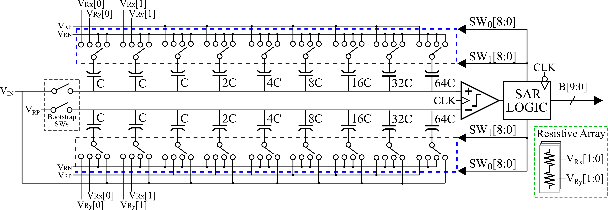

# Overview
This work presents a pseudo-differential SAR ADC designed to reduce **silicon area** while maintaining a compact implementation. The proposed architecture accepts a single-ended analog input while performing the conversion using a differential hybrid capacitive DAC.

A fully passive single-ended-to-differential (SE-to-D) conversion technique is integrated into the DAC switching scheme during the sampling phase. This approach eliminates the need for additional active front-end circuits, reducing implementation complexity. The proposed hybrid DAC architecture reduces the total capacitance from **1024 Cu** in a conventional binary-weighted implementation to only **129 Cu** (approximately **8×** smaller). This reduction is achieved by applying voltage scaling to the two least significant capacitor weights, requiring additional reference voltages generated by a resistive array. The main trade-off of this approach is the increase in static power consumption introduced by the reference generation network.

The figure below shows the schematic of the proposed ADC.


# Repository Structure

```text
designs/
└── sar_adc/
    ├── samplehold/
    ├── comparator/
    ├── digital/
    ├── dac/
    └── top/

docs/
├── README.md           # Team Git workflow
└── ...

.githooks/              # Repository safety hooks
first_setup.sh          # Initial repository setup
```

# Getting Started

Clone the repository and run the setup script:

```bash
git clone git@github.com:Gior-gio/Chipathon-2026-OnChipSAR.git
cd Chipathon-2026-OnChipSAR
./first_setup.sh
```

_Note:_ Remember to always open *xschem* inside the root directory

# Links

_Repository_: https://github.com/Gior-gio/Chipathon-2026-OnChipSAR

_Proposal_: https://drive.google.com/file/d/1cnjJn1mY6vDTXW3q3R2ybs9YaZu2KX3c/view?usp=sharing

# References

[1] A. Peña-Pérez et al., "A Low-Power Single-Ended SAR ADC With Energy-Efficient Differential Switching for Ultrafast X-Ray Imagers," in IEEE Open Journal of Circuits and Systems, vol. 7, pp. 255-268, 2026, doi: 10.1109/OJCAS.2025.3628857.

[2] Y.-Z. Lin et al. “A 0.9-V 11-bit 25-MS/s Binary-Search SAR ADC in 90-nm CMOS”. in: IEEE Asian Solid-State Circuits Conference 2011. Jeju, Korea (South), 2011, pp. 69–72. DOI: 10.1109/ASSCC.2011.6123606.

[3] J. Angarita-Pérez, N. Orcasitas-García, H. Hernandez-Herrera, and J. Ardila, “A Novel Common-Mode Compensation Technique for a Monotonic 10-bit 10-MS/s SAR ADC in a 28-nm CMOS Node,” Journal of Integrated Circuits and Systems, vol. 21, no. 1, 2026, doi: 10.29292/jics.v21i1.1018.
