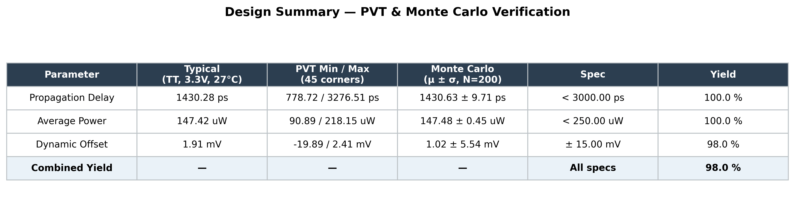

# Comparator Design for SAR ADC

This directory contains the design, schematics, symbols, and simulation testbenches for the dynamic comparator of the **On-Chip SAR ADC**. The comparator is implemented using a **StrongARM Latch** topology, which is chosen for its zero static power consumption, high speed, and high sensitivity.

---

## Directory Structure

The files are organized into three main subdirectories:

```
comparator/
├── README.md               # This documentation file
├── Inverter/               # Helper inverter cell
│   ├── inv.sch             # Inverter schematic (Xschem)
│   └── inv.sym             # Inverter symbol (Xschem)
├── StrongARM/              # Dynamic latch design
│   ├── strongARM.sch       # StrongARM Latch schematic (Xschem)
│   └── strongARM.sym       # StrongARM Latch symbol (Xschem)
└── Testbench/              # Simulation and characterization environment
    ├── strongARM_tb.sch    # Comparator testbench schematic (Xschem)
    ├── comparador_characterizer.ipynb    # Jupyter Notebook for comparator characterization
    └── comparador_pvt_montecarlo (1).ipynb # Jupyter Notebook for PVT and Monte Carlo simulations
```

---

## Component Details

### 1. Inverter (`Inverter/`)
* Contains `inv.sch` and `inv.sym`.
* This is a standard CMOS inverter cell used as a building block for output buffering or signal conditioning within the comparator design.

### 2. StrongARM Latch (`StrongARM/`)
* Contains `strongARM.sch` and `strongARM.sym`.
* The **StrongARM Latch** is the core dynamic regenerative comparator. It operates in two phases:
  * **Reset Phase (Clock is Low):** The outputs are precharged to $V_{DD}$ and no static current flows.
  * **Evaluation Phase (Clock is High):** The input differential voltage triggers a regenerative latching action, pulling one of the outputs to ground and pushing the other to $V_{DD}$.

### 3. Testbench (`Testbench/`)
Provides a comprehensive suite to verify the performance of the comparator under different conditions.

* **`strongARM_tb.sch`**: The main schematic testbench in Xschem to run transient simulations, verify functionality, and test basic timings.
* **`comparador_characterizer.ipynb`**: A Jupyter Notebook designed to automate transient simulations, extract parameters like delay, power consumption, and kickback noise.
* **`comparador_pvt_montecarlo (1).ipynb`**: A Jupyter Notebook that automates simulations across Process, Voltage, and Temperature (PVT) corners and executes Monte Carlo analyses to evaluate offset voltage due to mismatch.

---

## Results

Summary of the comparator's performance across PVT corners and Monte Carlo mismatch simulations, generated by `comparador_pvt_montecarlo (1).ipynb`:



---

## How to Simulate

### Prerequisites
Make sure you have the following tools installed and configured in your environment:
* **Xschem** (Schematic editor)
* **Ngspice** (SPICE simulator)
* **Jupyter Lab / Notebook** (with Python 3, PySpice or similar scripting integration)

### Running Schematics
1. Open Xschem from your terminal inside WSL:
   ```bash
   xschem
   ```
2. Navigate to and open `Testbench/strongARM_tb.sch` to view and simulate the testbench.

### Running Jupyter Notebooks
1. Start Jupyter:
   ```bash
   jupyter lab
   ```
2. Open either `comparador_characterizer.ipynb` or `comparador_pvt_montecarlo (1).ipynb` to run the python-driven spice simulations.
